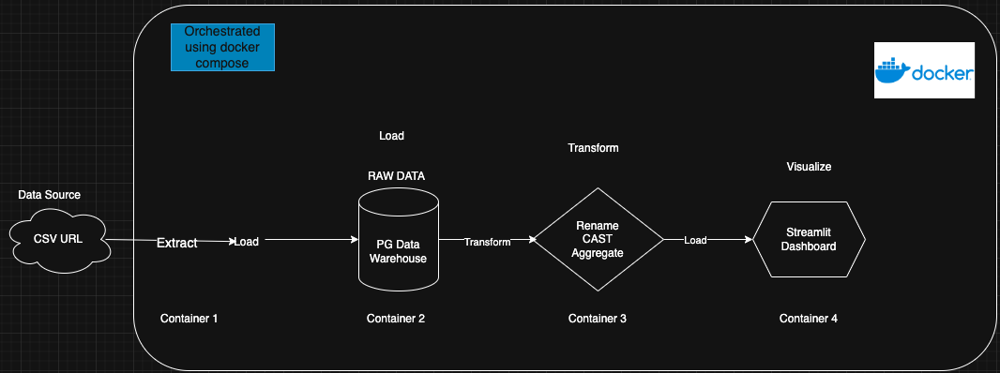

# ELT Pipeline of the New Zealanc Annual Enterprise Survey 2023

This project demonstrates a complete ELT (Extract, Load, Transform) pipeline with an interactive Streamlit dashboard for visualizing [New Zealand’s Annual Enterprise Survey (2023)](https://www.stats.govt.nz/assets/Uploads/Annual-enterprise-survey/Annual-enterprise-survey-2023-financial-year-provisional/Download-data/annual-enterprise-survey-2023-financial-year-provisional.csv).

It is a multi-container ELT service.

**The pipeline automates:**
1. Extract → A Python script downloads the CSV dataset.
2. Load → Data is stored in a PostgreSQL database.
3. Transform → Transformations are handled with dbt (staging + marts).
4. Visualize → A Streamlit dashboard simple charts.

**Tech Stack**
- Python + Pandas → Extraction & Loading
- PostgreSQL → Data warehouse
- dbt → SQL-based data transformation
- Streamlit → Data visualization
- Docker Compose → Container orchestration


### System Architecture



### How to run:
You don’t need to build anything locally, all images are already published to Docker Hub.
Just clone the repo, configure the environment file, and spin up the containers.
1. Clone repository
2. Move into the project directory 
    ```bash
    cd annual-enterprise-survey-elt
    ```

3. Create `.env` file with your own desired values; use this [link](https://www.stats.govt.nz/assets/Uploads/Annual-enterprise-survey/Annual-enterprise-survey-2023-financial-year-provisional/Download-data/annual-enterprise-survey-2023-financial-year-provisional.csv) for the CSV_URL.
    ```bash
    CSV_URL=
    DB_USER=
    DB_PASSWORD=
    DB_NAME=
    ```

4. Run the application
    ```bash
    docker-compose up -d
    ```

    This will automatically pull the following Docker Hub images:
    - bimiewoodcore/annual_enterprise_survey_2023_extractor:latest
    - bimiewoodcore/annual_enterprise_survey_2023_dbt:latest
    - bimiewoodcore/enterprise_survey_dashboard:latest
    - postgres:15


5. **Access the Dashboard**: Once all containers are up, open : 

    http://localhost:8502


To Stop and Clean Up
    ```bash
    docker-compose down -v
    ```

**System Requirements**
-  Docker 🐳 (version ≥ 20.10)
- Docker Compose (version ≥ 1.29)
- Internet access (for dataset download)


### Project Directory Overview

    elt-pipeline/
    ├── docker-compose.yml
    ├── .env (you have to create this yourself before running)
    ├── .gitignore
    ├── README.md
    │
    ├── extractor/
    │   ├── Dockerfile
    │   ├── extract.py
    │   └── requirements.txt
    │
    ├── dbt/
    │    ├── Dockerfile
    │    ├── dbt.yml
    │    ├── profiles.yml
    │    ├── requirements.txt
    │    └── models/
    │         ├── marts/
    │         │   └── yearly_financials.sql
    │         └── staging/
    │             └── transform_dbt_model.sql
    │ 
    └── dashboard/
        ├── Dockerfile
        ├── requirements.txt
        └── streamlit_dashboard.py

